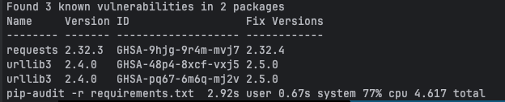
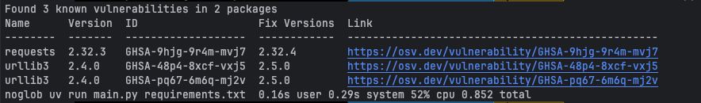

# uv-audit
pip-audit like vulnerability scanning but fast

My exampple requirements.txt:
```
# This file was autogenerated by uv via the following command:
#    uv pip compile pyproject.toml -o runtime/requirements.txt
annotated-types==0.7.0
    # via pydantic
anyio==4.9.0
    # via starlette
cachetools==5.5.2
    # via google-auth
certifi==2025.4.26
    # via requests
charset-normalizer==3.4.2
    # via requests
click==8.2.1
    # via
    #   flask
    #   functions-framework
cloudevents==1.12.0
    # via functions-framework
deprecation==2.1.0
    # via cloudevents
fastapi==0.115.12
    # via availability-profile (pyproject.toml)
flask==2.2.5
    # via
    #   functions-framework
    #   vellox
functions-framework==3.8.3
    # via availability-profile (pyproject.toml)
google-api-core==2.25.0
    # via
    #   google-cloud-core
    #   google-cloud-firestore
google-auth==2.40.3
    # via
    #   google-api-core
    #   google-cloud-core
    #   google-cloud-firestore
google-cloud-core==2.4.3
    # via google-cloud-firestore
google-cloud-firestore==2.21.0
    # via availability-profile (pyproject.toml)
googleapis-common-protos==1.70.0
    # via
    #   google-api-core
    #   grpcio-status
grpcio==1.72.1
    # via
    #   google-api-core
    #   grpcio-status
grpcio-status==1.72.1
    # via google-api-core
gunicorn==23.0.0
    # via functions-framework
idna==3.10
    # via
    #   anyio
    #   requests
itsdangerous==2.2.0
    # via flask
jinja2==3.1.6
    # via flask
markupsafe==3.0.2
    # via
    #   jinja2
    #   werkzeug
packaging==25.0
    # via
    #   deprecation
    #   gunicorn
proto-plus==1.26.1
    # via
    #   google-api-core
    #   google-cloud-firestore
protobuf==6.31.1
    # via
    #   google-api-core
    #   google-cloud-firestore
    #   googleapis-common-protos
    #   grpcio-status
    #   proto-plus
pyasn1==0.6.1
    # via
    #   pyasn1-modules
    #   rsa
pyasn1-modules==0.4.2
    # via google-auth
pydantic==2.11.5
    # via fastapi
pydantic-core==2.33.2
    # via pydantic
requests==2.32.3
    # via google-api-core
rsa==4.9.1
    # via google-auth
sniffio==1.3.1
    # via anyio
starlette==0.46.2
    # via fastapi
typing-extensions==4.14.0
    # via
    #   fastapi
    #   pydantic
    #   pydantic-core
    #   typing-inspection
    #   vellox
typing-inspection==0.4.1
    # via pydantic
urllib3==2.4.0
    # via requests
vellox==0.1.3
    # via availability-profile (pyproject.toml)
watchdog==6.0.0
    # via functions-framework
werkzeug==3.1.3
    # via
    #   flask
    #   functions-framework
```

scanned once with `pip-audit`

and once with `uv-audit`


uv-audit needs 0.852s and pip-audit needs 4.617s total to scan the same requirements.txt file.
I expect the time to diverge even more with larger requirements files or when using multiple requirements files.

# Usage
1. Install requirements: `uv pip install aiohttp`
2. run uv-audit: `python3 main.py requirements.txt requiremens2.txt`

Or directly with uv run: `uv run https://raw.githubusercontent.com/SpielerNogard/uv-audit/refs/heads/main/main.py requirements.txt`

