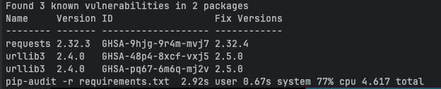
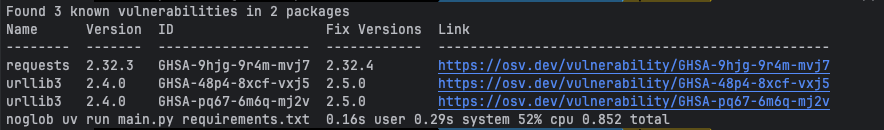

# uv-audit
pip-audit like vulnerability scanning but fast

My example requirements.txt:
```
# This file was autogenerated by uv via the following command:
#    uv pip compile pyproject.toml -o runtime/requirements.txt
annotated-types==0.7.0
    # via pydantic
anyio==4.9.0
    # via starlette
cachetools==5.5.2
    # via google-auth
certifi==2025.4.26
    # via requests
charset-normalizer==3.4.2
    # via requests
click==8.2.1
    # via
    #   flask
    #   functions-framework
cloudevents==1.12.0
    # via functions-framework
deprecation==2.1.0
    # via cloudevents
fastapi==0.115.12
    # via availability-profile (pyproject.toml)
flask==2.2.5
    # via
    #   functions-framework
    #   vellox
functions-framework==3.8.3
    # via availability-profile (pyproject.toml)
google-api-core==2.25.0
    # via
    #   google-cloud-core
    #   google-cloud-firestore
google-auth==2.40.3
    # via
    #   google-api-core
    #   google-cloud-core
    #   google-cloud-firestore
google-cloud-core==2.4.3
    # via google-cloud-firestore
google-cloud-firestore==2.21.0
    # via availability-profile (pyproject.toml)
googleapis-common-protos==1.70.0
    # via
    #   google-api-core
    #   grpcio-status
grpcio==1.72.1
    # via
    #   google-api-core
    #   grpcio-status
grpcio-status==1.72.1
    # via google-api-core
gunicorn==23.0.0
    # via functions-framework
idna==3.10
    # via
    #   anyio
    #   requests
itsdangerous==2.2.0
    # via flask
jinja2==3.1.6
    # via flask
markupsafe==3.0.2
    # via
    #   jinja2
    #   werkzeug
packaging==25.0
    # via
    #   deprecation
    #   gunicorn
proto-plus==1.26.1
    # via
    #   google-api-core
    #   google-cloud-firestore
protobuf==6.31.1
    # via
    #   google-api-core
    #   google-cloud-firestore
    #   googleapis-common-protos
    #   grpcio-status
    #   proto-plus
pyasn1==0.6.1
    # via
    #   pyasn1-modules
    #   rsa
pyasn1-modules==0.4.2
    # via google-auth
pydantic==2.11.5
    # via fastapi
pydantic-core==2.33.2
    # via pydantic
requests==2.32.3
    # via google-api-core
rsa==4.9.1
    # via google-auth
sniffio==1.3.1
    # via anyio
starlette==0.46.2
    # via fastapi
typing-extensions==4.14.0
    # via
    #   fastapi
    #   pydantic
    #   pydantic-core
    #   typing-inspection
    #   vellox
typing-inspection==0.4.1
    # via pydantic
urllib3==2.4.0
    # via requests
vellox==0.1.3
    # via availability-profile (pyproject.toml)
watchdog==6.0.0
    # via functions-framework
werkzeug==3.1.3
    # via
    #   flask
    #   functions-framework
```

scanned once with `pip-audit`


and once with `uv-audit`


uv-audit needs 0.852s and pip-audit needs 4.617s total to scan the same requirements.txt file.
I expect the time to diverge even more with larger requirements files or when using multiple requirements files.

# Usage

Install:
```
uv pip install .
```

Audit a requirements file:
```
uv-audit -r requirements.txt
```

Audit a pyproject.toml (main dependencies only):
```
uv-audit -r pyproject.toml
```

Include specific dependency groups and/or extras:
```
uv-audit -r pyproject.toml --group dev --extra cli
```

Include everything (all groups + all extras):
```
uv-audit -r pyproject.toml --all
```

Shortcut for a project directory (uses its pyproject.toml):
```
uv-audit ./my-project --all-groups
```

Mix files in one run:
```
uv-audit -r requirements.txt -r ./svc/pyproject.toml --all-groups
```

## Machine-readable output

Use `--json` to emit results as JSON on stdout (errors go to stderr). The
payload lists every scanned input — including clean ones — along with the
resolved groups/extras selection.

```
uv-audit -r pyproject.toml --all --json
```

Example output:
```json
{
  "vulnerable": true,
  "inputs": [
    {
      "source": "/abs/path/to/pyproject.toml",
      "kind": "pyproject",
      "groups": ["dev"],
      "extras": ["cli"],
      "vulnerabilities": [
        {
          "package": "flask",
          "version": "1.1.2",
          "id": "GHSA-XYZ",
          "fix_versions": ["2.0.0"],
          "link": "https://example.com"
        }
      ]
    },
    {
      "source": "/abs/path/to/requirements.txt",
      "kind": "requirements",
      "groups": [],
      "extras": [],
      "vulnerabilities": []
    }
  ]
}
```

For requirements files the `groups` and `extras` arrays are always empty so
the shape is identical across input kinds. Exit code is non-zero when any
vulnerability is found.

Quick recipes with `jq`:
```
uv-audit -r pyproject.toml --all --json | jq '.vulnerable'
uv-audit -r pyproject.toml --all --json | jq '.inputs[] | select(.vulnerabilities | length > 0)'
uv-audit -r pyproject.toml --all --json | jq -r '.inputs[].vulnerabilities[].id'
```

## Install as a uv tool

From PyPI (package name is `uv-audit2`, CLI command stays `uv-audit`):
```
uv tool install uv-audit2
uv-audit -r requirements.txt
```

Or directly from git:
```
uv tool install git+https://github.com/SpielerNogard/uv-audit.git@main
uv tool run uv-audit -r requirements.txt
```

## GitHub Action

`uv-audit` is also packaged as a reusable GitHub Action. The action discovers
`pyproject.toml` and `requirements*.txt` files in your repo, scans each for
known vulnerabilities, posts a sticky comment on the PR with findings, and
fails the build (configurable) when non-ignored vulnerabilities are present.

### Quick start (single job)

```yaml
name: audit
on: [pull_request]
permissions:
  contents: read
  pull-requests: write
jobs:
  audit:
    runs-on: ubuntu-latest
    steps:
      - uses: actions/checkout@v4
      - uses: SpielerNogard/uv-audit@0.2.0
        with:
          ignore_vulns: |
            PYSEC-2026-161
```

### Monorepo (parallel scanning across files)

```yaml
name: audit
on: [pull_request]
permissions:
  contents: read
  pull-requests: write
jobs:
  audit:
    uses: SpielerNogard/uv-audit/.github/workflows/scan.yml@0.2.0
    with:
      ignore_vulns: |
        PYSEC-2026-161
```

### Inputs

| Input | Default | Description |
|---|---|---|
| `path` | `.` | Root directory for discovery |
| `include` | `**/pyproject.toml`, `**/requirements*.txt` | Newline-separated glob patterns |
| `exclude` | `.venv`, `venv`, `.tox`, `node_modules`, `.git`, `dist`, `build`, `site-packages` | Path components or globs to skip |
| `ignore_vulns` | _(empty)_ | Vulnerability IDs to suppress |
| `fail_on_vuln` | `true` | Exit non-zero when non-ignored vulns are found |
| `pyproject_args` | `--all` | Extra CLI args for pyproject scans |
| `uv_audit_version` | _matches action tag_ | Version of `uv-audit2` installed from PyPI |
| `comment_on_pr` | `true` | Create/update the sticky PR comment |
| `github_token` | `${{ github.token }}` | Token used for the comment API |

### Outputs

| Output | Description |
|---|---|
| `vulnerable` | `'true'` or `'false'` |
| `vuln_count` | Number of non-ignored findings |
| `ignored_count` | Number of ignored findings |
| `report_json` | Aggregated JSON report |

### Private indexes

Composite actions inherit `env:` from the caller; pass any `UV_*` / `PIP_*`
environment variable to authenticate against private PyPI mirrors:

```yaml
- uses: SpielerNogard/uv-audit@0.2.0
  env:
    UV_INDEX_URL: https://pypi.example.com/simple
    UV_INDEX_USERNAME: ${{ secrets.PYPI_USER }}
    UV_INDEX_PASSWORD: ${{ secrets.PYPI_TOKEN }}
```
